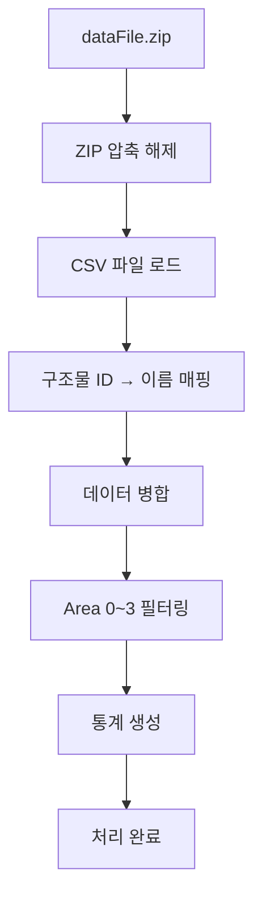
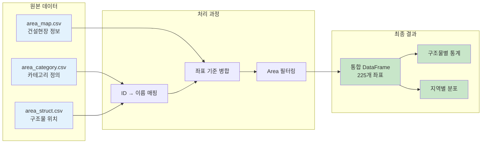
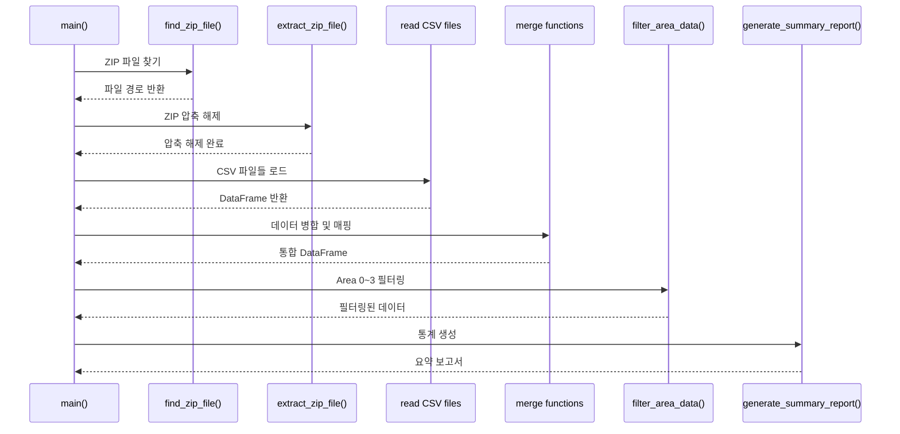

# 🔍 1단계: 데이터 분석 및 처리

## 📋 과제 개요
ZIP 파일에서 CSV 데이터를 추출하고 분석하여 지역 지도 데이터를 구조화하는 단계입니다.

## 📁 파일 구조
```
team-project/
├── dataFile.zip          # 원본 압축 데이터
├── mas_map.py            # 메인 데이터 처리 스크립트
├── area_category.csv     # 구조물 카테고리 정의
├── area_map.csv          # 좌표별 건설현장 정보
└── area_struct.csv       # 좌표별 구조물 및 지역 정보
```

## 🎯 주요 기능

### 1. ZIP 파일 처리
```python
def find_zip_file():
    # 현재 폴더에서 dataFile.zip 파일 찾기
    
def extract_zip_file(zip_file_path):
    # ZIP 파일 압축 해제
```

### 2. 데이터 병합 및 매핑
```python
def merge_area_struct_to_category(area_struct, area_category):
    # 구조물 ID를 카테고리 이름으로 변환
    # merge() 함수를 사용하여 DataFrame 병합
    
def merge_dataframes(area_struct_with_category, area_map):
    # 세 데이터를 하나의 DataFrame으로 병합
    # area 기준으로 정렬
```

### 3. 데이터 필터링
```python
def filter_area_data(merged_df):
    # area 0~3에 대한 데이터 필터링
    # area별 데이터 개수 출력
```

### 4. 통계 생성
```python
def generate_summary_report(merged_df):
    # 구조물 종류별 요약 통계 생성
    # 전체 통계 및 구조물별 개수 출력
```

## 📊 데이터 구조

### area_category.csv
| category | struct |
|----------|--------|
| 1 | Apartment |
| 2 | Building |
| 3 | MyHome |
| 4 | BandalgomCoffee |

### area_map.csv
| x | y | ConstructionSite |
|---|---|------------------|
| 1 | 1 | 0 |
| 1 | 2 | 0 |
| ... | ... | ... |

### area_struct.csv
| x | y | category | area |
|---|---|----------|------|
| 1 | 1 | 0 | 0 |
| 1 | 4 | 2 | 0 |
| ... | ... | ... | ... |

## 🔄 데이터 처리 흐름



## 🏗️ 데이터 구조 변환



## 📊 함수 호출 흐름



## 📈 처리 결과

### 데이터 규모
- **총 좌표**: 225개 (15×15 그리드)
- **지역 분포**:
  - Area 0: 49개
  - Area 1: 56개
  - Area 2: 56개
  - Area 3: 64개

### 구조물 분포
- **아파트**: 여러 개 위치
- **빌딩**: 여러 개 위치
- **내 집**: 1개 위치
- **반달곰 커피**: 2개 위치
- **건설 현장**: 여러 개 위치

## 🛠️ 핵심 기술

### 사용된 라이브러리
- **pandas**: 데이터 처리 및 분석
- **zipfile**: ZIP 파일 압축 해제
- **os**: 파일 시스템 접근

### 주요 알고리즘
- **데이터 병합**: pandas merge() 함수 활용
- **데이터 필터링**: 조건부 선택
- **통계 분석**: groupby() 및 집계 함수

## ✅ 성공 기준
- [x] ZIP 파일 자동 압축 해제
- [x] 세 개 CSV 파일 성공적 로드
- [x] 구조물 카테고리 매핑 완료
- [x] Area 0~3 데이터 필터링
- [x] 구조물별 통계 생성
- [x] 에러 처리 및 예외 상황 대응

## 🚀 다음 단계
처리된 데이터를 바탕으로 **2단계: 지도 시각화**로 진행합니다.
