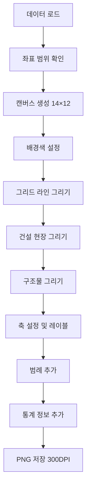
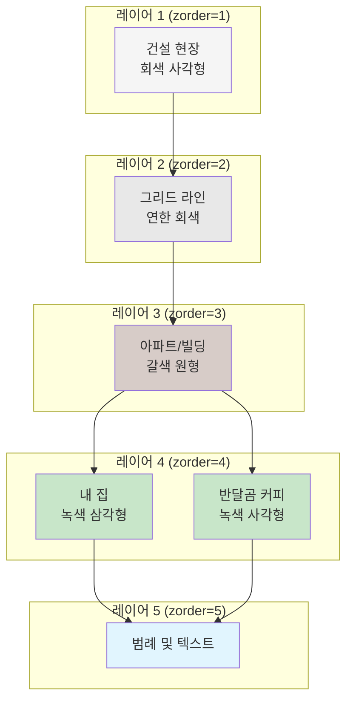
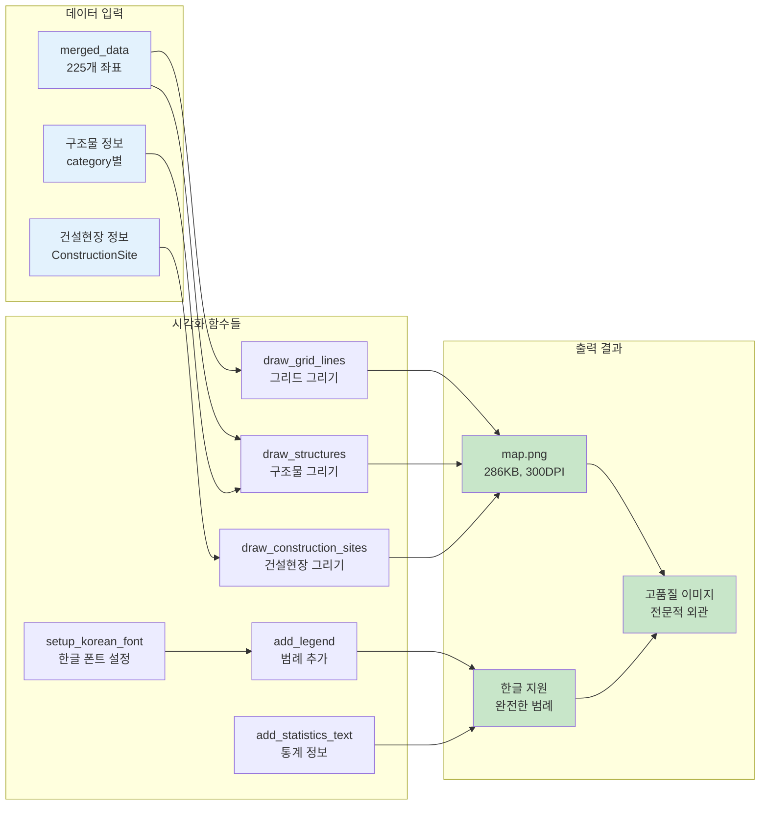
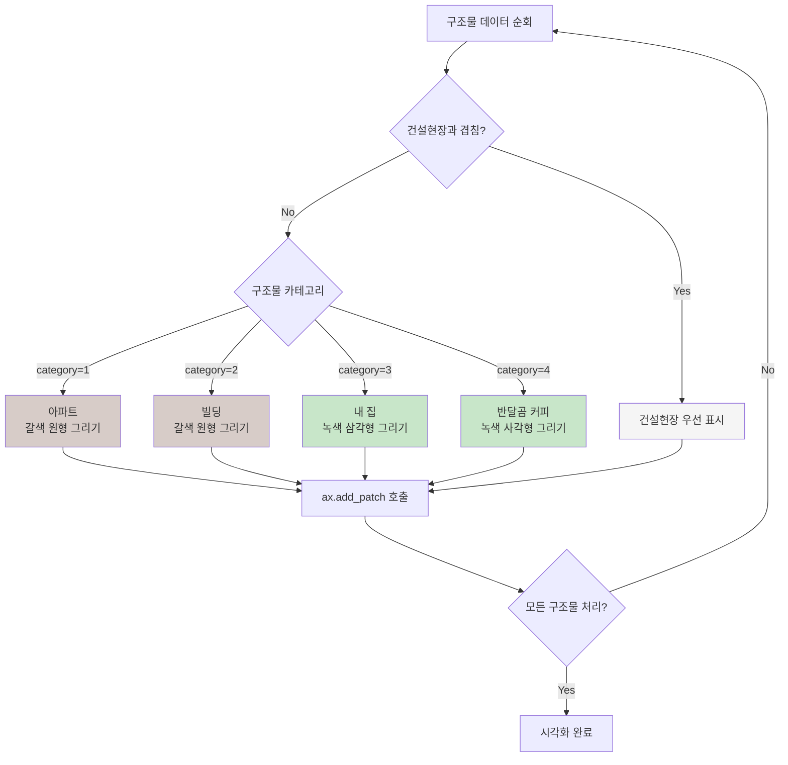

# 🗺️ 2단계: 지도 시각화

## 📋 과제 개요
분석된 데이터를 기반으로 15×15 그리드 지역 지도를 시각화하고 한글 지원 범례가 포함된 고품질 이미지를 생성합니다.

## 📁 파일 구조
```
team-project/
├── map_draw.py           # 지도 시각화 메인 스크립트
├── map.png              # 생성된 지도 이미지 (286KB)
└── mas_map.py           # 데이터 처리 모듈 (1단계에서 생성)
```

## 🎯 주요 기능

### 1. 한글 폰트 설정
```python
def setup_korean_font():
    # 운영체제별 한글 폰트 자동 설정
    # macOS: AppleGothic, Apple SD Gothic Neo
    # Windows: Malgun Gothic
    # Linux: Nanum Gothic
```

### 2. 지도 시각화 메인 함수
```python
def create_map_visualization():
    # 데이터 로딩 및 좌표 범위 확인
    # 그림 크기 설정 (14×12)
    # 배경색 및 그리드 라인 그리기
    # 구조물 시각화
    # 범례 및 통계 정보 추가
```

### 3. 그리드 시스템
```python
def draw_grid_lines(ax, x_min, x_max, y_min, y_max):
    # 세로 그리드 라인 (X축) 그리기
    # 가로 그리드 라인 (Y축) 그리기
    # 좌측 상단 (1,1) 시작점 설정
```

### 4. 구조물별 시각화
```python
def draw_structures(ax, data):
    # 아파트/빌딩: 갈색 원형 ⚫
    # 내 집: 녹색 삼각형 ▲
    # 반달곰 커피: 녹색 사각형 ⬜
    # 건설 현장 우선 표시 규칙 적용
```

### 5. 건설 현장 처리
```python
def draw_construction_sites(ax, data):
    # 회색 사각형으로 표시
    # 다른 구조물과 겹칠 때 우선 표시
    # 살짝 겹치도록 크기 조정 (0.9×0.9)
```

## 🎨 시각적 요소

### 구조물 표현
| 구조물 | 모양 | 색상 | 크기 |
|--------|------|------|------|
| 아파트/빌딩 | 원형 ⚫ | 갈색 (brown) | 반지름 0.35 |
| 내 집 | 삼각형 ▲ | 녹색 (green) | 높이 0.4 |
| 반달곰 커피 | 사각형 ⬜ | 라임그린 (limegreen) | 0.6×0.6 |
| 건설 현장 | 사각형 ⬜ | 회색 (lightgray) | 0.9×0.9 |

### 색상 팔레트
- **배경**: 연한 회색 (#f8f9fa)
- **그리드**: 연한 회색 (lightgray, alpha=0.6)
- **구조물**: 갈색, 녹색 계열
- **건설 현장**: 회색 계열

## 📊 지도 사양

### 좌표 시스템
- **그리드 크기**: 15×15 (225개 좌표)
- **시작점**: 좌측 상단 (1,1)
- **끝점**: 우측 하단 (15,15)
- **Y축**: 뒤집기 적용 (상단이 작은 값)

### 이미지 품질
- **해상도**: 300 DPI
- **파일 형식**: PNG
- **파일 크기**: 286KB
- **배경**: 흰색
- **투명도**: 없음

## 🏷️ 범례 및 정보

### 범례 구성
```python
def add_legend(ax):
    # 아파트/빌딩 - 갈색 원형
    # 내 집 - 녹색 삼각형  
    # 반달곰 커피 - 녹색 사각형
    # 건설 현장 - 회색 사각형
```

### 통계 정보
```python
def add_statistics_text(ax, data, x_max, y_min):
    # 구조물별 개수 표시
    # 총 좌표 개수
    # 파란색 정보 박스로 표시
```

## 🔄 시각화 흐름



## 🎨 구조물 렌더링 순서



## 🖼️ 시각화 컴포넌트 구조



## 🎯 구조물별 시각화 로직



## 🛠️ 핵심 기술

### 사용된 라이브러리
- **matplotlib.pyplot**: 기본 플롯 생성
- **matplotlib.patches**: 도형 그리기 (원, 사각형, 다각형)
- **numpy**: 삼각형 좌표 계산
- **platform**: 운영체제별 폰트 설정

### 고급 기능
- **한글 폰트 자동 감지**: 운영체제별 최적 폰트 선택
- **zorder 레이어링**: 구조물 겹침 순서 제어
- **alpha 투명도**: 시각적 깊이감 표현
- **bbox 텍스트 박스**: 정보 가독성 향상

## 📈 성능 최적화

### 렌더링 최적화
- **zorder 활용**: 레이어 순서로 불필요한 재그리기 방지
- **alpha 블렌딩**: 자연스러운 겹침 표현
- **적절한 마커 크기**: 가독성과 성능 균형

### 메모리 효율성
- **plt.close()**: 메모리 누수 방지
- **적절한 DPI**: 품질과 파일 크기 균형

## ✅ 성공 기준
- [x] 15×15 그리드 정확한 표시
- [x] 좌측 상단 (1,1) 시작점 구현
- [x] 구조물별 차별화된 시각 표현
- [x] 건설 현장 우선 표시 규칙
- [x] 한글 범례 및 통계 정보
- [x] 고해상도 PNG 파일 생성
- [x] 범례와 통계 정보 포함

## 🎯 시각화 결과

### 생성된 파일
- **map.png**: 286KB, 300 DPI 고품질 이미지
- **완전한 한글 지원**: 제목, 축 레이블, 범례 모두 한글
- **전문적인 외관**: 그림자, 테두리, 색상 조화

### 사용자 경험
- **직관적 이해**: 구조물별 명확한 구분
- **정보 풍부**: 통계와 범례로 완전한 정보 제공
- **고품질 출력**: 인쇄 및 프레젠테이션 적합

## 🚀 다음 단계
시각화된 지도를 바탕으로 **3단계: 최단 경로 탐색**으로 진행합니다.
